<h1 align="center"> :black_medium_square: Cadastro de Projetos :black_medium_square: </h1>

 :wave: Hey! This is a projects registration program that I developed for the college, using the C language.

## How it works
(This program is in Portuguese)

<ol>

<li>

:small_blue_diamond:When the program is opened, this Menu will appear:

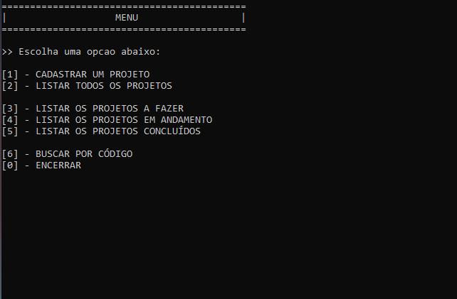
</li>

<li>

:small_blue_diamond:To register a project, just press 1, then this screen will appear:

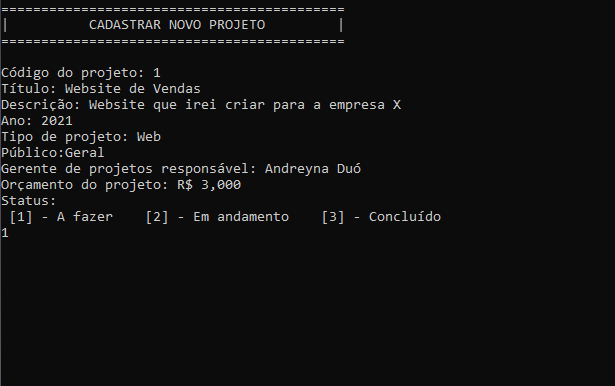
</li>

<li>

:small_blue_diamond:After registering one or more projects, you can list them all by pressing 2:

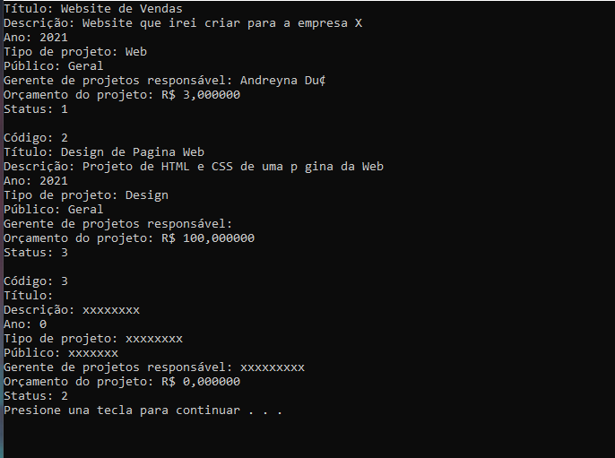

If you don't have any projects registered, you will come across this message:

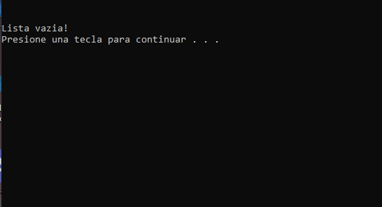
</li>

<li>

:small_blue_diamond:When registering a project, you put a status: 1 - To be done, 2 - In progress and 3 - completed.

By pressing keys 3, 4 and 5, you can list the projects by status respectively. 

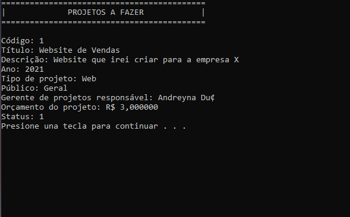
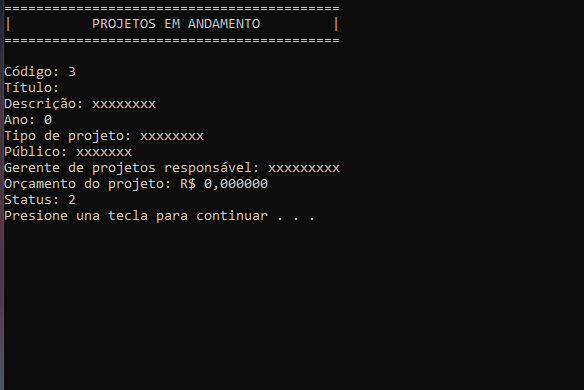
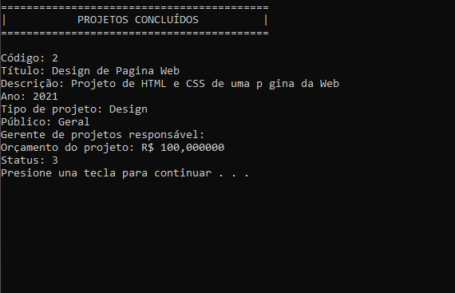

If there are no projects with a certain status, you will see this message:

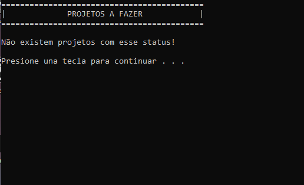
</li>

<li>

:small_blue_diamond:Every time you register a project, a code is generated. And you can search the projects by their code by pressing 6.

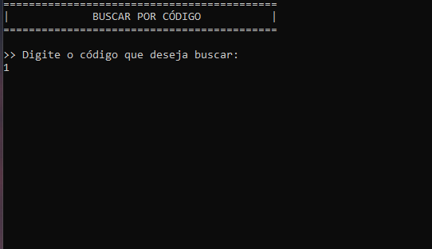
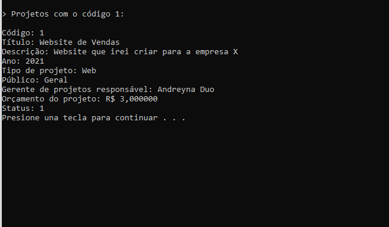
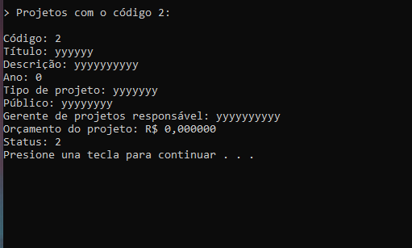
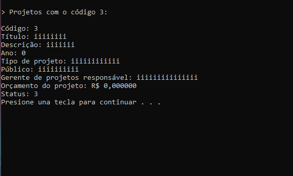

If you try to search for a code that is not registered, this message will appear:

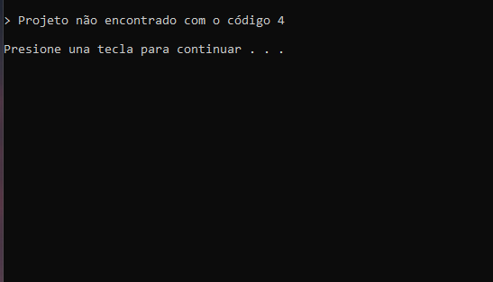
</li>

<li>

:small_blue_diamond:Finally, if you want to terminate the program, just press 0.

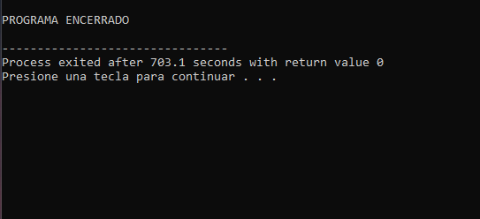
</li>

</ol>

This is a very simple program, but it illustrates my knowledge. Hope you like it. 😉

